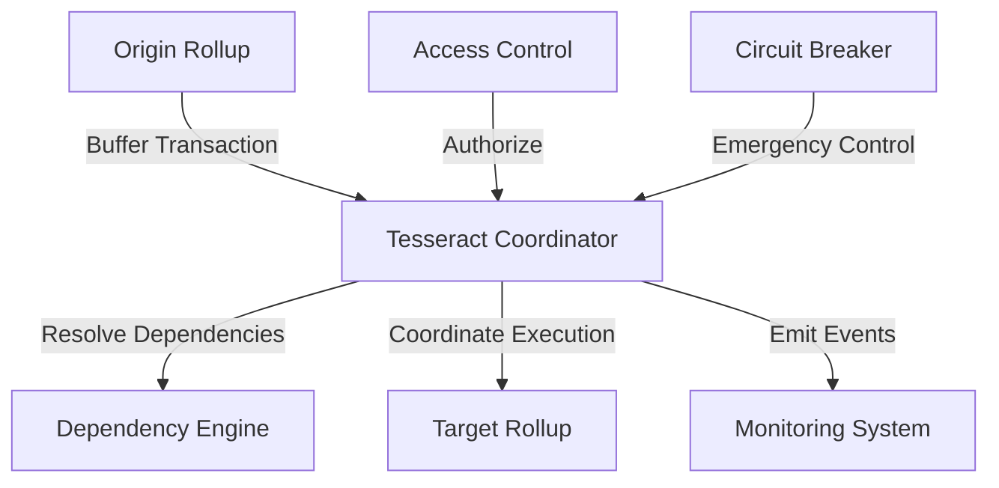

# Tesseract: Cross-Rollup Atomic Transaction Execution

[](https://opensource.org/licenses/MIT)
[](https://vyper.readthedocs.io/)
[](https://python.org)

Tesseract is a production-ready cross-rollup atomic transaction execution system that enables coordinated transaction processing across multiple Layer 2 rollups. Built with Vyper for maximum security and inspired by the latest research in blockchain interoperability.

## Use Cases

### Cross-Chain DeFi Operations
Execute atomic transactions across multiple rollups for DeFi protocols:
- **Arbitrage**: Execute simultaneous trades across Ethereum, Polygon, and Arbitrum
- **Liquidity Management**: Rebalance liquidity pools across multiple chains atomically
- **Cross-Chain Lending**: Coordinate collateral deposits and borrows across rollups
- **Multi-Chain Governance**: Execute governance decisions across multiple networks

### Enterprise Cross-Chain Workflows
Enable complex business logic across blockchain networks:
- **Supply Chain**: Track and verify goods across multiple blockchain networks
- **Identity Management**: Synchronize identity states across enterprise rollups
- **Payment Rails**: Coordinate payments and settlements across different networks
- **Data Synchronization**: Ensure consistent state across multi-chain applications

### Infrastructure and Protocol Integration
Build robust cross-chain infrastructure:
- **Bridge Protocols**: Coordinate secure asset transfers between rollups
- **Oracle Networks**: Synchronize data feeds across multiple chains
- **Cross-Chain DAOs**: Enable governance across multiple blockchain networks
- **Interoperability Layers**: Build universal compatibility between rollups

## Quick Start

```bash
# Clone and setup environment
git clone https://github.com/your-org/tesseract.git
cd tesseract
poetry install

# Verify contract compilation
poetry run python scripts/test_compilation.py

# Deploy to local network (requires local blockchain node)
poetry run python scripts/deploy_simple.py
```

**Documentation**: [docs/](docs/) | **Contributing**: [CONTRIBUTING.md](CONTRIBUTING.md)

## Core Features

### Security-First Architecture
- **Vyper smart contracts** with built-in overflow protection and memory safety
- **Role-based access control** with granular operator permissions
- **Input validation** and state transition protection
- **Emergency circuit breaker** for critical incident response

### Cross-Rollup Coordination
- **Atomic transaction execution** across multiple Layer 2 rollups
- **Dependency resolution** with directed acyclic graph validation
- **Time-bounded coordination windows** for guaranteed execution timing
- **Automatic rollback mechanisms** for failed or expired transactions

### Multi-Network Support
- **Ethereum** (Mainnet and Sepolia testnet)
- **Polygon** (Mainnet and Mumbai testnet)
- **Arbitrum** (One and Goerli testnet)
- **Optimism** (Mainnet and Goerli testnet)
- **Extensible architecture** for additional rollup integration

### Production Features
- **Event-driven monitoring** with comprehensive transaction lifecycle tracking
- **Gas-optimized operations** with minimal on-chain storage requirements
- **Deterministic state transitions** for predictable cross-chain behavior
- **Comprehensive testing suite** with unit and integration test coverage

## Architecture



**Core Components:**
- **TesseractSimple.vy**: Main coordination contract (7,276 bytes compiled bytecode)
- **Transaction Buffer**: Secure storage for cross-rollup transaction data
- **Dependency Resolution Engine**: Validates and resolves transaction dependencies
- **Access Control Layer**: Role-based operator authorization system
- **Event System**: Comprehensive transaction lifecycle monitoring

## Documentation

| Document | Description |
|----------|-------------|
| [System Architecture](docs/SYSTEM_ARCHITECTURE.md) | Technical architecture and design patterns |
| [Deployment Guide](docs/DEPLOYMENT_GUIDE_UPDATED.md) | Complete deployment instructions for working system |
| [API Documentation](docs/API_DOCUMENTATION_UPDATED.md) | Complete API reference with actual contract functions |
| [Security Guidelines](docs/SECURITY_GUIDELINES.md) | Security best practices and audit requirements |
| [Testing Framework](docs/TESTING_FRAMEWORK.md) | Comprehensive testing strategy |
| [Production Checklist](docs/PRODUCTION_DEPLOYMENT_CHECKLIST.md) | Complete production deployment checklist |
| [Testnet Roadmap](docs/TESTNET_ROADMAP.md) | 4-week roadmap to production deployment |

## Development Setup

### Prerequisites
- **Python 3.11+**: Required for Vyper compiler and development tools
- **Poetry**: Dependency management and virtual environment handling
- **Git**: Version control and repository management
- **Testnet funds**: ETH for Sepolia, MATIC for Mumbai (see deployment guide)

### Installation
```bash
# Clone repository
git clone https://github.com/your-org/tesseract.git
cd tesseract

# Install dependencies using Poetry
poetry install

# Verify installation
poetry run python --version
poetry run python -c "import vyper; print(f'Vyper: {vyper.__version__}')"
```

### Local Development
```bash
# Test contract compilation
poetry run python scripts/test_compilation.py

# Deploy to local network (requires local blockchain node)
poetry run python scripts/deploy_simple.py

# Run basic functionality tests
poetry run python scripts/test_basic.py
```

## Integration Examples

### Basic Cross-Rollup Transaction
```python
from web3 import Web3
import json
import time

# Load contract artifacts
with open('artifacts/TesseractSimple.json', 'r') as f:
    contract_data = json.load(f)

# Connect to network
w3 = Web3(Web3.HTTPProvider('YOUR_RPC_URL'))
contract = w3.eth.contract(
    address="0x...",  # Deployed contract address
    abi=contract_data['abi']
)

# Buffer a cross-rollup transaction
tx_id = b'\x01' * 32
receipt = contract.functions.buffer_transaction(
    tx_id,
    "0xOriginRollupAddress",
    "0xTargetRollupAddress",
    b"transaction payload",
    b'\x00' * 32,  # No dependency
    int(time.time()) + 300  # 5 minutes from now
).transact({'from': operator_address})
```

### Dependency Chain Management
```python
# Create a chain of dependent transactions
transactions = [
    {"id": b'\x01' * 32, "dependency": b'\x00' * 32},  # No dependency
    {"id": b'\x02' * 32, "dependency": b'\x01' * 32},  # Depends on first
    {"id": b'\x03' * 32, "dependency": b'\x02' * 32},  # Depends on second
]

# Buffer all transactions
for tx in transactions:
    contract.functions.buffer_transaction(
        tx["id"], origin_rollup, target_rollup,
        payload, tx["dependency"], timestamp
    ).transact({'from': operator_address})

# Resolve dependencies in order
for tx in transactions:
    contract.functions.resolve_dependency(tx["id"]).transact({'from': operator_address})
    is_ready = contract.functions.is_transaction_ready(tx["id"]).call()
    print(f"Transaction {tx['id'].hex()[:8]} ready: {is_ready}")
```

### Event Monitoring
```python
# Monitor transaction lifecycle events
def monitor_tesseract_events():
    event_filter = contract.events.TransactionBuffered.createFilter(fromBlock='latest')

    while True:
        for event in event_filter.get_new_entries():
            print(f"Transaction buffered: {event.args.tx_id.hex()}")
            print(f"Origin: {event.args.origin_rollup}")
            print(f"Target: {event.args.target_rollup}")

        time.sleep(2)
```

## Testing

### Validation Suite
```bash
# Test contract compilation
poetry run python scripts/test_compilation.py

# Validate basic functionality
poetry run python scripts/test_basic.py

# Run comprehensive tests
poetry run pytest tests/
```

### Contract Verification
```bash
# Validate contract compilation
poetry run vyper contracts/TesseractSimple.vy

# Check bytecode size and ABI
poetry run python scripts/test_compilation.py
```

## Deployment

### Local Development
```bash
# Deploy to local blockchain (requires local node)
poetry run python scripts/deploy_simple.py
```

### Testnet Deployment
```bash
# Configure environment variables
export PRIVATE_KEY="0x..."
export RPC_URL="https://sepolia.infura.io/v3/YOUR_API_KEY"

# Deploy to testnet
poetry run python scripts/deploy_simple.py

# Verify deployment
poetry run python scripts/test_compilation.py
```

### Production Status
- **Contract Development**: Complete
- **Local Testing**: Complete
- **Testnet Deployment**: Ready
- **Security Audit**: Pending
- **Cross-Chain Testing**: Pending
- **Production Deployment**: Pending

See [Production Checklist](docs/PRODUCTION_DEPLOYMENT_CHECKLIST.md) for complete deployment requirements.

## Security

Tesseract implements multiple security layers:

- **Smart Contract Security**: Vyper with built-in overflow protection and memory safety
- **Access Control**: Role-based permissions with owner and operator roles
- **Input Validation**: Comprehensive validation of all transaction parameters
- **State Protection**: Immutable transaction data with controlled state transitions
- **Emergency Controls**: Circuit breaker mechanisms for critical incident response

**Security Audit Status**: Pending professional third-party audit

See [Security Guidelines](docs/SECURITY_GUIDELINES.md) for detailed security information.

## Performance

### Current Benchmarks
- **Contract Size**: 7,276 bytes compiled bytecode
- **Gas Usage**: ~80,000 gas per transaction buffer
- **Dependency Resolution**: ~40,000 gas per resolution
- **State Updates**: ~25,000 gas per execution marking

### Optimization Features
- **Minimal Storage**: Efficient state storage with 512-byte payload limit
- **Gas Optimization**: Vyper compiler optimizations for reduced costs
- **Event Efficiency**: Indexed events for optimized filtering and monitoring
- **Deterministic Execution**: Predictable gas costs for cross-chain coordination

## Contributing

We welcome contributions to the Tesseract protocol. Please see our [Contributing Guidelines](CONTRIBUTING.md).

### Development Process
1. Fork the repository
2. Create a feature branch (`git checkout -b feature/descriptive-name`)
3. Make your changes following our coding standards
4. Add tests for new functionality
5. Ensure all tests pass (`poetry run python scripts/test_compilation.py`)
6. Submit a pull request with detailed description

### Code Standards
- Follow [Vyper Style Guide](https://vyper.readthedocs.io/en/stable/style-guide.html) for smart contracts
- Use [Black](https://black.readthedocs.io/) for Python code formatting
- Add comprehensive docstrings for all functions
- Include unit tests for all new functionality

## License

This project is licensed under the MIT License - see the [LICENSE](LICENSE) file for details.

```
MIT License

Copyright (c) 2024 Tesseract Protocol

Permission is hereby granted, free of charge, to any person obtaining a copy
of this software and associated documentation files (the "Software"), to deal
in the Software without restriction, including without limitation the rights
to use, copy, modify, merge, publish, distribute, sublicense, and/or sell
copies of the Software, and to permit persons to whom the Software is
furnished to do so, subject to the following conditions:

The above copyright notice and this permission notice shall be included in all
copies or substantial portions of the Software.

THE SOFTWARE IS PROVIDED "AS IS", WITHOUT WARRANTY OF ANY KIND, EXPRESS OR
IMPLIED, INCLUDING BUT NOT LIMITED TO THE WARRANTIES OF MERCHANTABILITY,
FITNESS FOR A PARTICULAR PURPOSE AND NONINFRINGEMENT. IN NO EVENT SHALL THE
AUTHORS OR COPYRIGHT HOLDERS BE LIABLE FOR ANY CLAIM, DAMAGES OR OTHER
LIABILITY, WHETHER IN AN ACTION OF CONTRACT, TORT OR OTHERWISE, ARISING FROM,
OUT OF OR IN CONNECTION WITH THE SOFTWARE OR THE USE OR OTHER DEALINGS IN THE
SOFTWARE.
```

## Acknowledgments

- Inspired by the [CRATE Protocol](https://arxiv.org/html/2502.04659v1) research
- Built with [Vyper](https://vyper.readthedocs.io/) smart contract language
- Development workflow powered by [Poetry](https://python-poetry.org/)
- Cross-rollup coordination patterns from 2024 blockchain research

## Support & Community

- **Documentation**: [docs/](docs/)
- **Issues**: [GitHub Issues](https://github.com/your-org/tesseract/issues)
- **Discussions**: [GitHub Discussions](https://github.com/your-org/tesseract/discussions)
- **Discord**: [Tesseract Community](https://discord.gg/tesseract)
- **Twitter**: [@TesseractProtocol](https://twitter.com/tesseractprotocol)

---

**Built for the multi-rollup future**
