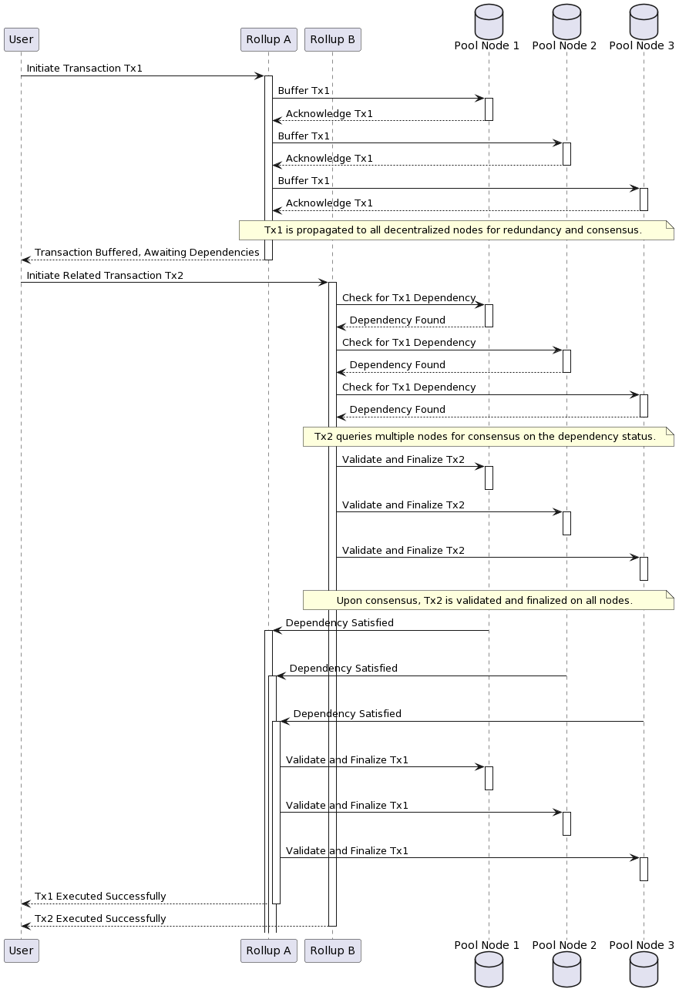

# Project Tesseract

### Cryptuon Research

**Founder:** Dipankar Sarkar

*Towards Universal Atomic Composability: A Formal Model for Multi-Rollup Environments on Ethereum*

---

# Dipankar Sarkar

**Web3 History:** Co-Founder, Boom Protocol, India/UK (2021-22)
- We built multi-chain API, MPC wallet, and high-scale cloud infrastructure. Ran Sales & Product.
- $2.5M in pre-product commitments and secured business from major companies. (Till FTX fiasco & RBI issues)

**Education:**
- M.S. in Computer Science (Cybersecurity), Arizona State University (2021)
- B.Tech in Computer Science, Indian Institute of Technology, Delhi (2007)

*Decentralisation*, *Blockchain*, *Federated Machine Learning*, *Edge ML*, *Cryptography* , 
*10 & 4 year old*, *Sci-Fi*,  *Gaming*, *Single Malts*, *Long walks* 

---

# Problem Statement: Composability Challenges

**1. Rollups in Ethereum: Enhancing Throughput**
- **Definition**: Scaling solutions that process transactions off-chain, summarizing them to the main Ethereum chain.
- **Benefit**: Increases network throughput without overloading the Ethereum network.

**2. Composability: The 'Money Legos' of Blockchain**
- **Concept**: Ability of decentralized applications (dApps) and smart contracts to integrate and utilize each other's features.
- **Analogy**: Each protocol/dApp is like a Lego piece, capable of forming various combinations.

---

**3. Composability Challenges Between Rollups**
- *Atomic Transactions*: Synchronization of transactions across rollups is complex due to varying consensus algorithms and latencies.
- *Data Availability*: Accessing and interfacing with data or contracts on different rollups can be challenging and costly.
- *Differing Standards*: Varied rules and standards across rollups create barriers to seamless interactions.

---

# Solution and Unique Value Proposition

**Addressing Composability Challenges: A Formal Model**
- **Objective**: To uphold transactional integrity and reliability across multiple Ethereum rollups.
- **Approach**: Combines classic distributed system theories with innovative cryptographic practices.

**Tailored for Ethereum's Ecosystem**
- Recognizes the limitations of adapting traditional theories directly to blockchain.
- Develops a model specifically for decentralized ledgers within Ethereum.

---

**Key Components of the Model**
- **Fundamental Definitions**: Establishes basic terminologies such as R (Set of rollups), T (Set of transactions), Pd (Decentralized common pool).
- **Operational Dynamics**: Examines transactional workflows, dependency resolutions, and concurrency nuances.
- **Cryptographic Methodologies**: Extensible with zero-knowledge proofs for efficient, confidential transaction validations.

**Impact and Aspiration**
- Aims to provide a comprehensive, clear, and rigorous understanding of establishing atomic composability in multi-rollup environments.
- **Innovative Contributions**: Pioneers in formalizing a structured approach to tackle cross-rollup composability challenges.

---

## Technical Innovation

### Transaction Handling
- **Key Definitions**: Set of rollups, transactions, etc.
- **Operations**: Publish, Buffer, Resolve, Verify 

### Decentralized Common Pool (DCP)
- **Consensus Mechanism**: We employ a consensus mechanism for node agreement.
- **Concurrency Handling**: Implements timestamping and buffering strategies to manage transaction dependencies and delays.

---

### Rollup Interaction and Monitoring
- **Staking Mechanism**: Incentivizes rollup adherence to the system's rules through a staking and slashing mechanism.
- **Monitoring and Misbehavior Proof**: Allows third-party nodes to monitor and report rollup misbehavior, ensuring compliance.

### Zero-Knowledge Proofs (zk-proofs)
- **Privacy & Validation**: zk-proofs enable transaction validation while maintaining privacy across rollups.
- **Efficiency**: zk-SNARKs and zk-STARKs used for their compactness and swift validation capabilities, crucial in multi-rollup systems.
- **Dependency Verification**: Facilitates the verification of dependencies between transactions from different rollups without revealing transaction details.

---

# TL;DR: The Essence of Tesseract

### Focusing on the Core
- **Beyond the Paper**: Delving into the key concepts and practical implications rather than getting lost in the minutiae.
- **Understanding 'Why' and 'How'**: Unpacking the reasoning and methodology behind our innovative model.

### Why Project Tesseract Matters
- **Addressing a Key Challenge**: Solving a critical issue in Ethereum's scalability and interoperability.
- **Real-World Impact**: Demonstrating how our solution translates to tangible benefits in the blockchain ecosystem.

---

# Business Model and Market Fit

### Market Opportunity
- **Growing Market**: The market for rollups tokens is currently valued at over $3.82 billion.
- **Demand for Scalability Solutions**: With Ethereum's scalability challenges, there's a high demand for efficient rollup solutions.

### Revenue Streams
- **Partnerships**: Collaborations with established blockchain networks and startups to integrate the model.
- **DCP tokenomics**: Potential for the DCP to become a public utility with long term tokenomics. 

---

### Competitive Advantage
- **Unique Solution**: Addresses the specific challenge of atomic composability across multiple Ethereum rollups.
- **Technical Expertise**: Led by a founder with deep knowledge in blockchain technology and cryptography.

### Long-Term Vision
- **Market Leadership**: Aiming to become a key player in the Ethereum rollups space.
- **Expansion**: Potential to adapt the model for other blockchain platforms beyond Ethereum.

---

# Proof of Concept (WIP)

### Prototype Overview
- **Developed in Vyper**: Utilizes Vyper language for enhanced security and simplicity in smart contract development.
- **Focus on Atomic Composability**: Demonstrates the practical implementation of the formal model in handling cross-rollup transactions.

### Key Features
- **Smart Contract Execution**: Showcases smart contracts operating across multiple Ethereum rollups.
- **Vyper's Advantages**: Leverages Vyper's readability and security features to build robust and maintainable code.

---

# Closing Remarks & Next Steps
### Key Takeaways
- **Innovative Solution**: Addressing atomic composability challenges in Ethereum rollups with a formal model.
- **Cryptographic System**: Advanced cryptographic methods and a decentralized system for efficient, secure transaction handling.
- **Significant Market Opportunity**: Poised to capture a growing market in blockchain scalability.

### Your Involvement
- **Guidance**: We welcome your thoughts and feedback on this approach.
- **Collaboration**: This needs a village to be built and distributed. 