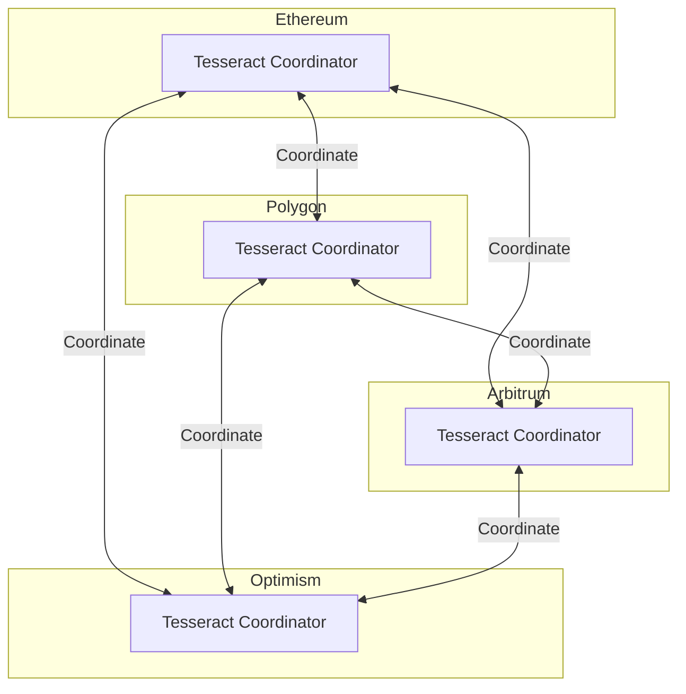
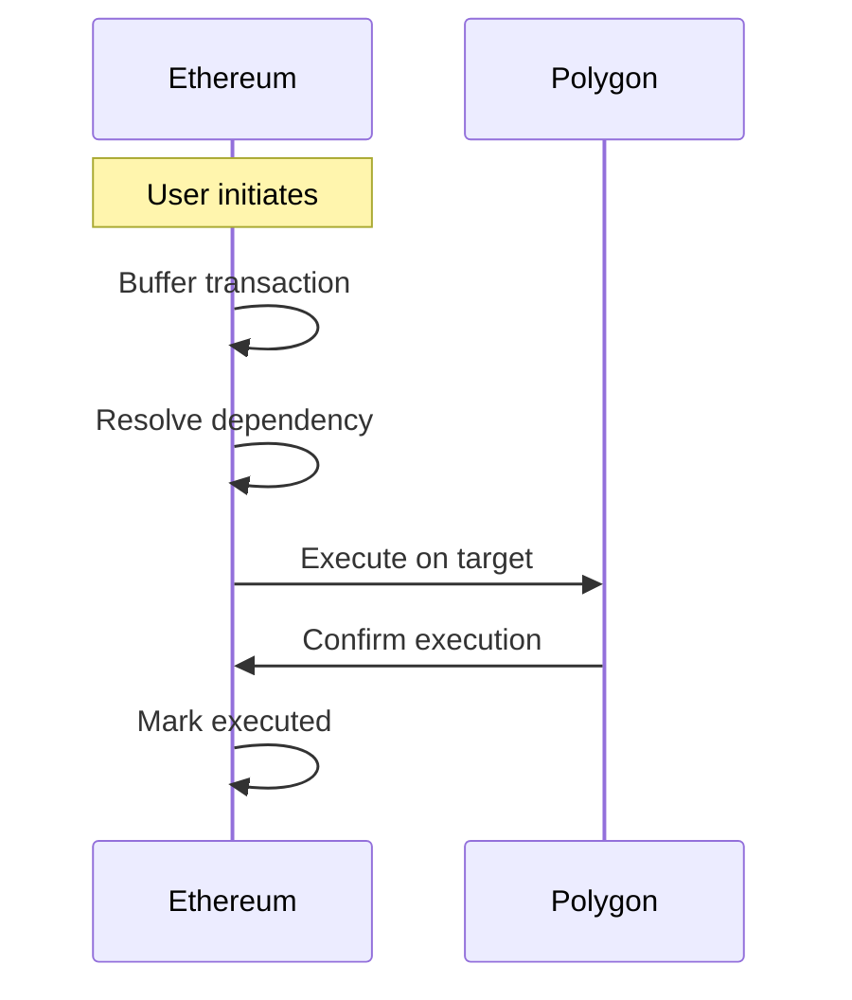
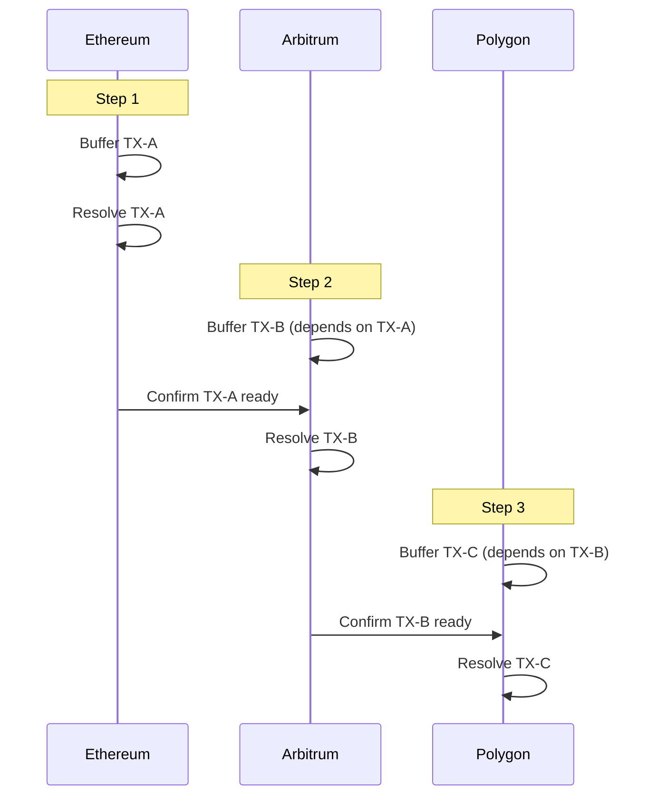
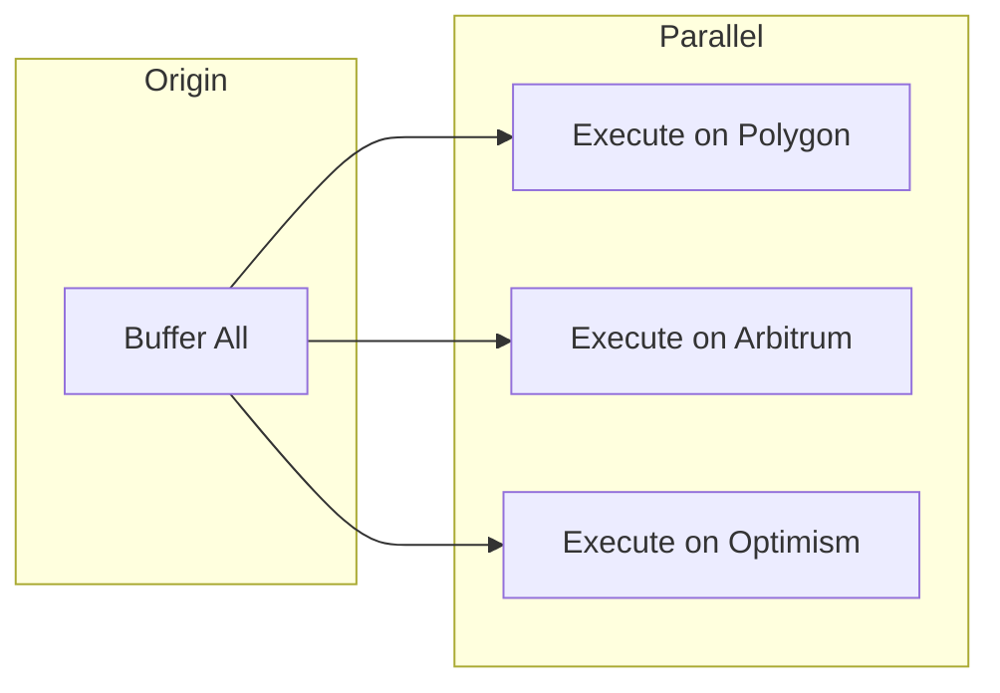
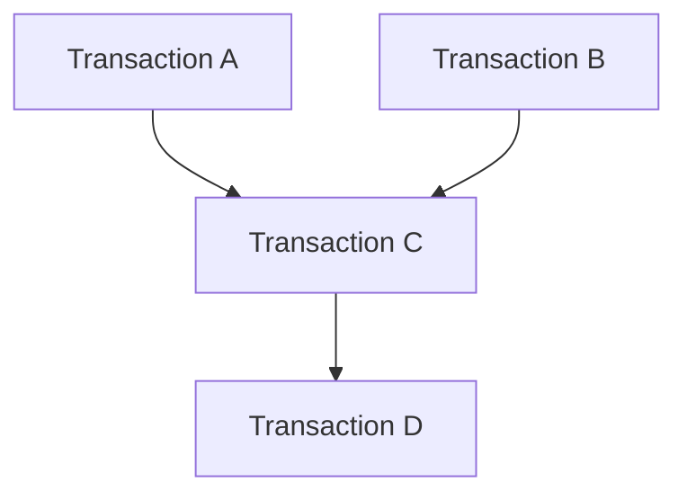
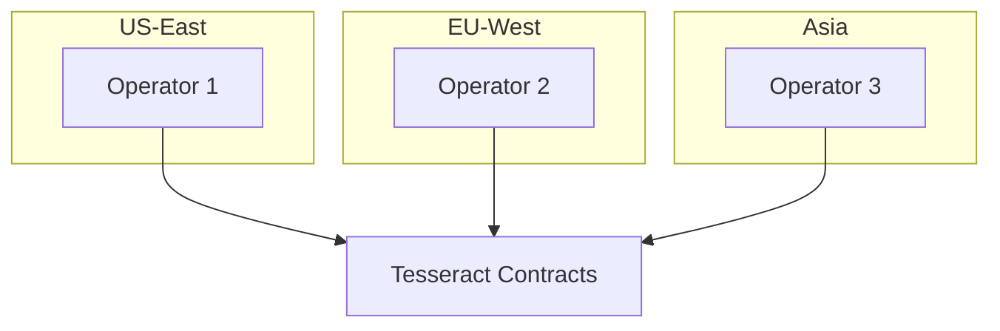

# Cross-Rollup Coordination

How Tesseract coordinates transaction execution across multiple rollups.

---

## Multi-Chain Architecture

Tesseract is designed for deployment across multiple Layer 2 rollups:



---

## Supported Networks

| Network | Mainnet | Testnet |
|---------|---------|---------|
| Ethereum | Mainnet | Sepolia |
| Polygon | Mainnet | Mumbai |
| Arbitrum | One | Goerli |
| Optimism | Mainnet | Goerli |

---

## Coordination Patterns

### 1. Point-to-Point Transfer

Simple transfer between two rollups:



**Example:**

```python
# Transfer from Ethereum to Polygon
tx_id = generate_tx_id()

# Buffer on Ethereum
eth_contract.functions.buffer_transaction(
    tx_id,
    eth_contract.address,      # Origin: Ethereum
    polygon_contract.address,  # Target: Polygon
    payload,
    b'\x00' * 32,             # No dependency
    execution_time
).transact({'from': operator})
```

### 2. Multi-Hop Coordination

Transaction spanning multiple rollups in sequence:



### 3. Parallel Execution

Multiple independent transactions across rollups:



---

## Dependency Graphs

### Linear Dependencies

```python
# Transaction chain: A -> B -> C
transactions = [
    {"id": b'\x01' * 32, "dependency": b'\x00' * 32},  # A: no dependency
    {"id": b'\x02' * 32, "dependency": b'\x01' * 32},  # B: depends on A
    {"id": b'\x03' * 32, "dependency": b'\x02' * 32},  # C: depends on B
]

# Buffer all
for tx in transactions:
    contract.functions.buffer_transaction(
        tx["id"], origin, target, payload, tx["dependency"], timestamp
    ).transact({'from': operator})

# Resolve in order
for tx in transactions:
    contract.functions.resolve_dependency(tx["id"]).transact({'from': operator})
```

### DAG Dependencies



!!! note "Current Limitation"
    The current implementation supports single dependencies. DAG support with multiple dependencies is planned for future releases.

---

## Cross-Chain State Synchronization

### Event-Based Synchronization

Monitor events on origin chain to trigger actions on target:

```python
def sync_cross_chain(origin_contract, target_contract):
    """Synchronize state between chains."""

    # Watch for ready transactions on origin
    event_filter = origin_contract.events.TransactionReady.createFilter(
        fromBlock='latest'
    )

    while True:
        for event in event_filter.get_new_entries():
            tx_id = event.args.tx_id

            # Get transaction details
            details = origin_contract.functions.get_transaction_details(tx_id).call()
            origin, target, dep, timestamp, state = details

            # If this targets our chain, execute
            if target == target_contract.address:
                execute_on_target(target_contract, tx_id, details)

        time.sleep(2)
```

### Merkle Proof Verification

For trustless cross-chain verification (future feature):

```python
# Verify transaction inclusion on origin chain
def verify_cross_chain(origin_proof, target_contract):
    # Verify Merkle proof
    is_valid = verify_merkle_proof(
        origin_proof.root,
        origin_proof.leaf,
        origin_proof.path
    )

    if is_valid:
        # Safe to execute on target
        target_contract.functions.mark_executed(tx_id).transact()
```

---

## Timing Coordination

### Coordination Window

All transactions must be resolved within the coordination window:

```python
# Default: 30 seconds
# Configurable: 5-300 seconds

# Set custom window (owner only)
contract.functions.set_coordination_window(60).transact({'from': owner})
```

### Cross-Chain Timing

Account for block time differences:

| Network | Block Time | Finality |
|---------|------------|----------|
| Ethereum | ~12s | ~15 min |
| Polygon | ~2s | ~5 min |
| Arbitrum | ~0.25s | ~15 min |
| Optimism | ~2s | ~15 min |

**Best Practice:** Set execution timestamps with sufficient buffer:

```python
# Allow for worst-case cross-chain latency
buffer_time = 300  # 5 minutes
execution_time = int(time.time()) + buffer_time
```

---

## Operator Network

### Distributed Operators

Deploy operators across regions for reliability:



### Operator Responsibilities

| Task | Frequency | Priority |
|------|-----------|----------|
| Monitor events | Continuous | High |
| Resolve dependencies | On-demand | High |
| Mark executions | On-demand | Medium |
| Health checks | Every minute | Medium |

---

## Error Recovery

### Failed Resolution

```python
def handle_failed_resolution(contract, tx_id):
    """Handle failed dependency resolution."""

    # Check failure reason
    logs = contract.events.TransactionFailed.getLogs(
        argument_filters={'tx_id': tx_id}
    )

    for log in logs:
        reason = log.args.reason

        if "expired" in reason:
            # Transaction missed its window
            # User needs to create new transaction
            notify_user_expired(tx_id)

        elif "dependency" in reason:
            # Dependency not satisfied
            # Check and resolve dependency first
            dep_id = get_dependency(tx_id)
            contract.functions.resolve_dependency(dep_id).transact()
```

### Circuit Breaker

Emergency pause for critical issues:

```python
# Owner can pause operations
contract.functions.pause().transact({'from': owner})

# Resume when safe
contract.functions.unpause().transact({'from': owner})
```

---

## Performance Considerations

### Gas Costs by Network

| Network | Buffer Gas | Resolve Gas |
|---------|------------|-------------|
| Ethereum | ~80,000 | ~40,000 |
| Polygon | ~80,000 | ~40,000 |
| Arbitrum | ~80,000 | ~40,000 |
| Optimism | ~80,000 | ~40,000 |

### Throughput

- **Target**: 1000+ transactions per coordination window
- **Bottleneck**: Block space on individual rollups
- **Optimization**: Batch processing in application layer

---

## Next Steps

- [Security Model](security-model.md) - Security architecture
- [Deployment Guide](../guides/deployment.md) - Multi-chain deployment
- [Monitoring](../guides/monitoring.md) - Cross-chain monitoring
