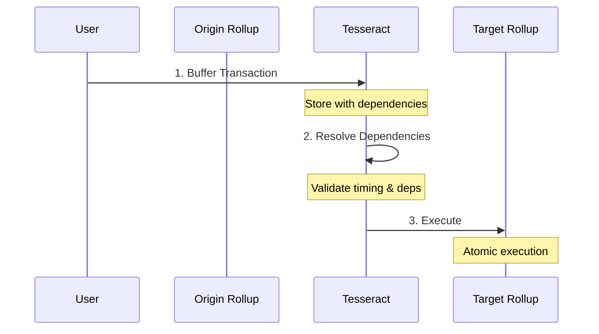
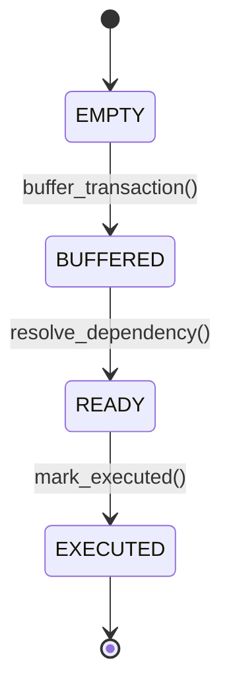

# Core Concepts

Understanding the fundamental concepts behind Tesseract's cross-rollup coordination.

---

## The Cross-Rollup Challenge

Modern blockchain ecosystems consist of multiple Layer 2 rollups, each with their own state and execution environment. Coordinating transactions across these rollups presents challenges:

- **Atomicity**: How do you ensure all parts of a multi-chain transaction succeed or fail together?
- **Ordering**: How do you coordinate execution timing across independent chains?
- **Dependencies**: How do you handle transactions that depend on other transactions?

Tesseract solves these challenges with a **buffer-resolve-execute** pattern.

---

## Buffer-Resolve-Execute Pattern



### 1. Buffer Phase

Transactions are submitted to the Tesseract coordinator with:

- **Transaction ID**: Unique 32-byte identifier
- **Origin/Target Rollups**: Source and destination addresses
- **Payload**: Transaction data (max 512 bytes)
- **Dependencies**: Other transactions that must complete first
- **Timestamp**: When the transaction can be executed

### 2. Resolve Phase

The coordinator validates:

- **Timing**: Is the current time within the coordination window?
- **Dependencies**: Are all required transactions ready or executed?
- **State**: Is the transaction in the correct state for resolution?

### 3. Execute Phase

Once resolved, transactions are marked as ready and can be executed on target rollups. The coordinator tracks execution status.

---

## Transaction States

Transactions progress through a linear state machine:



| State | Value | Description |
|-------|-------|-------------|
| `EMPTY` | 0 | Default state - transaction doesn't exist |
| `BUFFERED` | 1 | Transaction stored, awaiting resolution |
| `READY` | 2 | Dependencies resolved, ready for execution |
| `EXECUTED` | 3 | Successfully executed |

---

## Coordination Windows

Tesseract uses time-bounded coordination windows to ensure predictable execution:

- **Default Window**: 30 seconds
- **Configurable Range**: 5-300 seconds
- **Purpose**: Prevent indefinite waiting and ensure timely resolution

```python
# Transaction must be resolved within window
if current_time > transaction.timestamp + coordination_window:
    # Transaction expired - mark as failed
```

---

## Dependency Resolution

Transactions can declare dependencies on other transactions:

```python
# Transaction B depends on Transaction A
tx_a = b'\x01' * 32  # First transaction
tx_b = b'\x02' * 32  # Depends on tx_a

# Buffer with dependency
contract.buffer_transaction(
    tx_b,           # This transaction
    origin, target,
    payload,
    tx_a,           # Must complete first
    timestamp
)
```

A dependency is satisfied when the referenced transaction is in `READY` or `EXECUTED` state.

---

## Access Control

Tesseract implements role-based access control:

| Role | Permissions |
|------|-------------|
| **Owner** | Add/remove operators, configure settings |
| **Operator** | Buffer, resolve, and execute transactions |

```vyper
# Only operators can buffer transactions
assert self.authorized_operators[msg.sender], "Not authorized"
```

---

## Key Components

### TesseractSimple.vy

The main coordination contract:

- **Size**: 7,276 bytes compiled
- **Language**: Vyper 0.3.10
- **Functions**: 18 total (8 external, 5 view, 5 storage)

### Transaction Buffer

Secure storage for pending transactions:

```vyper
struct Transaction:
    origin_rollup: address
    target_rollup: address
    payload: Bytes[512]
    dependency_tx_id: bytes32
    timestamp: uint256
    state: State
```

### Event System

Comprehensive transaction lifecycle tracking:

- `TransactionBuffered` - New transaction stored
- `TransactionReady` - Dependencies resolved
- `TransactionFailed` - Resolution failed

---

## Design Principles

### Security First

- Vyper's built-in overflow protection
- No external contract calls (prevents reentrancy)
- Explicit access control with assertions

### Simplicity

- Linear state transitions
- Minimal storage footprint
- Clear, auditable code

### Gas Efficiency

- ~80,000 gas per buffer
- ~40,000 gas per resolution
- ~25,000 gas per execution marking

---

## Next Steps

- [Transaction Lifecycle](transaction-lifecycle.md) - Deep dive into states
- [Cross-Rollup Coordination](cross-rollup-coordination.md) - Multi-chain patterns
- [Security Model](security-model.md) - Security architecture
