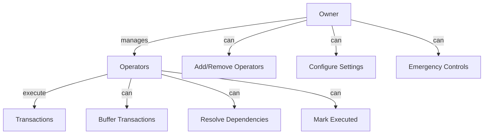
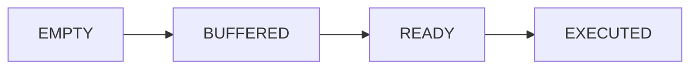

# Security Model

Understanding Tesseract's security architecture and best practices.

---

## Security Principles

Tesseract is built on four core security principles:

1. **Defense in Depth** - Multiple layers of protection
2. **Least Privilege** - Minimal necessary permissions
3. **Fail Secure** - Safe defaults on errors
4. **Explicit Authorization** - No implicit permissions

---

## Smart Contract Security

### Vyper Language Choice

Tesseract uses Vyper for its security properties:

| Feature | Benefit |
|---------|---------|
| No inheritance | Simpler, auditable code |
| Bounds checking | Automatic overflow protection |
| No inline assembly | Reduced attack surface |
| Explicit typing | Fewer type confusion bugs |
| No modifiers | Clear control flow |

### Code Example

```vyper
# Explicit access control
@external
def buffer_transaction(
    tx_id: bytes32,
    origin_rollup: address,
    target_rollup: address,
    payload: Bytes[512],
    dependency_tx_id: bytes32,
    timestamp: uint256
):
    # Explicit authorization check
    assert self.authorized_operators[msg.sender], "Not authorized"

    # Input validation
    assert tx_id != empty(bytes32), "Invalid transaction ID"
    assert origin_rollup != empty(address), "Invalid origin rollup"
    assert target_rollup != empty(address), "Invalid target rollup"
    assert origin_rollup != target_rollup, "Origin and target must be different"
    assert timestamp >= block.timestamp, "Timestamp cannot be in the past"

    # State validation
    assert self.transactions[tx_id].state == State.EMPTY, "Transaction already exists"

    # Safe state modification
    self.transactions[tx_id] = Transaction({...})
```

---

## Access Control

### Role Hierarchy



### Permission Matrix

| Action | Owner | Operator | Public |
|--------|-------|----------|--------|
| `add_operator` | Yes | No | No |
| `remove_operator` | Yes | No | No |
| `set_coordination_window` | Yes | No | No |
| `buffer_transaction` | No | Yes | No |
| `resolve_dependency` | No | Yes | No |
| `mark_executed` | No | Yes | No |
| `get_transaction_state` | Yes | Yes | Yes |
| `is_transaction_ready` | Yes | Yes | Yes |

### Implementation

```vyper
# Storage
owner: public(address)
authorized_operators: public(HashMap[address, bool])

# Owner-only function
@external
def add_operator(operator: address):
    assert msg.sender == self.owner, "Only owner can add operators"
    assert operator != empty(address), "Invalid operator address"
    self.authorized_operators[operator] = True

# Operator-only function
@external
def buffer_transaction(...):
    assert self.authorized_operators[msg.sender], "Not authorized"
    # ... rest of function
```

---

## Input Validation

### Transaction ID

```vyper
# Must be non-empty 32 bytes
assert tx_id != empty(bytes32), "Invalid transaction ID"
```

### Addresses

```vyper
# Must be valid, non-zero addresses
assert origin_rollup != empty(address), "Invalid origin rollup"
assert target_rollup != empty(address), "Invalid target rollup"

# Must be different
assert origin_rollup != target_rollup, "Origin and target must be different"
```

### Timestamps

```vyper
# Cannot be in the past
assert timestamp >= block.timestamp, "Timestamp cannot be in the past"
```

### Coordination Window

```vyper
# Must be within safe bounds
assert window >= 5, "Window must be at least 5 seconds"
assert window <= 300, "Window must be at most 300 seconds"
```

### Payload Size

```vyper
# Limited to 512 bytes for gas efficiency
payload: Bytes[512]
```

---

## State Protection

### Immutable Transaction Data

Once buffered, transaction data cannot be modified:

```vyper
# Check uniqueness before storing
assert self.transactions[tx_id].state == State.EMPTY, "Transaction already exists"

# Store immutably
self.transactions[tx_id] = Transaction({
    origin_rollup: origin_rollup,
    target_rollup: target_rollup,
    payload: payload,
    dependency_tx_id: dependency_tx_id,
    timestamp: timestamp,
    state: State.BUFFERED
})
```

### Linear State Transitions

States can only progress forward:



```vyper
# State validation before transition
assert self.transactions[tx_id].state == State.BUFFERED, "Transaction not in buffered state"

# Only then update state
self.transactions[tx_id].state = State.READY
```

---

## Reentrancy Protection

### No External Calls

Tesseract makes no external contract calls, eliminating reentrancy risk:

```vyper
# No call(), delegatecall(), or external contract interactions
# All state changes are internal

@external
def mark_executed(tx_id: bytes32):
    assert self.authorized_operators[msg.sender], "Not authorized"
    assert self.transactions[tx_id].state == State.READY, "Transaction not ready"

    # Direct state update - no external calls
    self.transactions[tx_id].state = State.EXECUTED

    # Event emission (safe)
    log TransactionExecuted(tx_id)
```

---

## Emergency Controls

### Circuit Breaker

Owner can pause operations in emergencies:

```vyper
paused: public(bool)

@external
def pause():
    assert msg.sender == self.owner, "Only owner"
    self.paused = True

@external
def unpause():
    assert msg.sender == self.owner, "Only owner"
    self.paused = False

@external
def buffer_transaction(...):
    assert not self.paused, "Contract is paused"
    # ... rest of function
```

### Owner Transfer

Secure ownership transfer:

```vyper
pending_owner: address

@external
def transfer_ownership(new_owner: address):
    assert msg.sender == self.owner, "Only owner"
    self.pending_owner = new_owner

@external
def accept_ownership():
    assert msg.sender == self.pending_owner, "Only pending owner"
    self.owner = self.pending_owner
    self.pending_owner = empty(address)
```

---

## Known Limitations

### Single Dependency

Current implementation supports one dependency per transaction. DAG dependencies are planned.

### Off-Chain Coordination

Cross-chain state verification relies on trusted operators. Future versions will add Merkle proof verification.

### Gas Price Fluctuations

No built-in gas price protection. Applications should implement their own gas management.

---

## Security Checklist

### Before Deployment

- [ ] Code review by security expert
- [ ] Third-party security audit
- [ ] Test suite with edge cases
- [ ] Access control verification
- [ ] Gas limit testing

### Deployment

- [ ] Use hardware wallet for owner key
- [ ] Verify bytecode matches source
- [ ] Test on testnet first
- [ ] Configure initial operators carefully
- [ ] Set appropriate coordination window

### Operations

- [ ] Monitor operator activity
- [ ] Track unusual transaction patterns
- [ ] Maintain operator key security
- [ ] Regular security reviews
- [ ] Incident response plan ready

---

## Reporting Vulnerabilities

If you discover a security vulnerability:

1. **Do NOT** disclose publicly
2. Email security@tesseract-protocol.io
3. Include detailed reproduction steps
4. Allow reasonable time for fix

We offer a bug bounty program for responsible disclosure.

---

## Audit Status

| Audit | Status | Date |
|-------|--------|------|
| Internal Review | Complete | 2024 |
| External Audit | Pending | TBD |
| Formal Verification | Planned | TBD |

---

## Next Steps

- [Deployment Guide](../guides/deployment.md) - Secure deployment practices
- [API Reference](../api/contract-api.md) - Function security notes
- [Monitoring](../guides/monitoring.md) - Security monitoring
