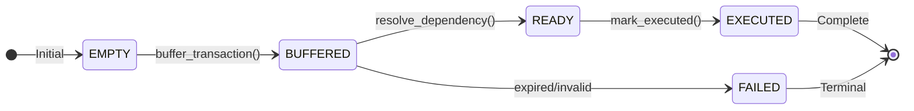

# Transaction Lifecycle

A detailed look at how transactions flow through the Tesseract system.

---

## State Machine

Every transaction in Tesseract follows a strict state progression:



---

## States in Detail

### EMPTY (0)

The default state for any transaction ID that hasn't been used.

```python
state = contract.functions.get_transaction_state(tx_id).call()
# Returns 0 if transaction doesn't exist
```

### BUFFERED (1)

Transaction has been submitted and stored. At this stage:

- Transaction data is immutable
- Dependencies have been recorded (but not validated)
- Waiting for resolution

```python
# Buffer a transaction
contract.functions.buffer_transaction(
    tx_id,
    origin_rollup,
    target_rollup,
    payload,
    dependency_tx_id,
    timestamp
).transact({'from': operator})

# State is now BUFFERED
```

### READY (2)

Dependencies have been resolved and timing requirements met:

- All dependency transactions are READY or EXECUTED
- Current time >= transaction timestamp
- Current time <= timestamp + coordination_window

```python
# Resolve dependencies
contract.functions.resolve_dependency(tx_id).transact({'from': operator})

# If successful, state is now READY
is_ready = contract.functions.is_transaction_ready(tx_id).call()
```

### EXECUTED (3)

Transaction has been successfully executed on the target rollup.

```python
# Mark as executed
contract.functions.mark_executed(tx_id).transact({'from': operator})

# Final state
```

---

## Lifecycle Timeline

```mermaid
gantt
    title Transaction Lifecycle
    dateFormat X
    axisFormat %s

    section Buffering
    Submit Transaction    :a1, 0, 1
    Store in Buffer       :a2, 1, 2

    section Resolution
    Wait for Timestamp    :b1, 2, 5
    Check Dependencies    :b2, 5, 6
    Mark Ready           :b3, 6, 7

    section Execution
    Execute on Target    :c1, 7, 8
    Mark Executed        :c2, 8, 9
```



---

## Validation Rules

### At Buffer Time

| Check | Validation |
|-------|------------|
| Transaction ID | Must be non-empty `bytes32` |
| Origin Rollup | Must be valid address |
| Target Rollup | Must be valid, different from origin |
| Timestamp | Cannot be in the past |
| Uniqueness | Transaction ID must not exist |
| Authorization | Caller must be operator |

### At Resolution Time

| Check | Validation |
|-------|------------|
| State | Must be BUFFERED |
| Timing | Current time >= timestamp |
| Window | Current time <= timestamp + window |
| Dependencies | Dependency must be READY or EXECUTED |

### At Execution Time

| Check | Validation |
|-------|------------|
| State | Must be READY |
| Timing | Timestamp must have passed |
| Authorization | Caller must be operator |

---

## Error Handling

### Expired Transactions

If a transaction isn't resolved within the coordination window, it fails:

```python
# Transaction was buffered at timestamp 1000
# Coordination window is 30 seconds
# Current time is 1035 (past window)

# Resolution will fail with TransactionFailed event
contract.functions.resolve_dependency(tx_id).transact({'from': operator})
# Emits: TransactionFailed(tx_id, "Transaction expired")
```

### Unmet Dependencies

If a dependency transaction isn't ready:

```python
# tx_b depends on tx_a
# tx_a is still BUFFERED (not READY)

contract.functions.resolve_dependency(tx_b).transact({'from': operator})
# Emits: TransactionFailed(tx_b, "Dependency not satisfied")
```

---

## Events

### TransactionBuffered

Emitted when a new transaction is buffered.

```python
event TransactionBuffered:
    tx_id: indexed(bytes32)
    origin_rollup: indexed(address)
    target_rollup: indexed(address)
    timestamp: uint256
```

### TransactionReady

Emitted when dependencies are resolved successfully.

```python
event TransactionReady:
    tx_id: indexed(bytes32)
```

### TransactionFailed

Emitted when resolution fails.

```python
event TransactionFailed:
    tx_id: indexed(bytes32)
    reason: String[100]
```

---

## Monitoring Example

```python
def monitor_transaction(contract, tx_id):
    """Monitor a transaction through its lifecycle."""

    # Initial state
    state = contract.functions.get_transaction_state(tx_id).call()
    print(f"Current state: {state}")

    # Set up event filters
    ready_filter = contract.events.TransactionReady.createFilter(
        fromBlock='latest',
        argument_filters={'tx_id': tx_id}
    )

    failed_filter = contract.events.TransactionFailed.createFilter(
        fromBlock='latest',
        argument_filters={'tx_id': tx_id}
    )

    # Poll for events
    while True:
        for event in ready_filter.get_new_entries():
            print(f"Transaction ready: {event.args.tx_id.hex()}")
            return "READY"

        for event in failed_filter.get_new_entries():
            print(f"Transaction failed: {event.args.reason}")
            return "FAILED"

        time.sleep(2)
```

---

## Best Practices

### 1. Use Unique Transaction IDs

Generate unique IDs using hashing:

```python
import hashlib

def generate_tx_id(origin, target, payload, nonce):
    data = origin + target + payload + str(nonce).encode()
    return hashlib.sha256(data).digest()
```

### 2. Set Reasonable Timestamps

Allow enough time for cross-chain propagation:

```python
# Allow 5 minutes for execution
execution_time = int(time.time()) + 300
```

### 3. Handle Failures Gracefully

Always check for failure events:

```python
try:
    contract.functions.resolve_dependency(tx_id).transact({'from': operator})
except Exception as e:
    # Check for failure event
    logs = contract.events.TransactionFailed.getLogs(...)
```

---

## Next Steps

- [Cross-Rollup Coordination](cross-rollup-coordination.md) - Multi-chain patterns
- [API Reference](../api/contract-api.md) - Complete function reference
- [Examples](../examples/basic-usage.md) - Working code examples
