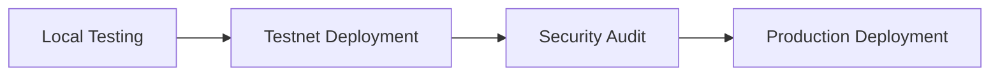

# Deployment Guide

Complete guide to deploying Tesseract to testnets and production.

---

## Deployment Overview



---

## Prerequisites

- Python 3.11+ and Poetry installed
- Testnet ETH/tokens for gas
- RPC endpoints (Infura, Alchemy, etc.)
- Secure private key management

---

## Local Deployment

### Start Local Node

=== "Anvil"
    ```bash
    anvil
    ```

=== "Ganache"
    ```bash
    ganache-cli --deterministic
    ```

### Deploy Contract

```python
from web3 import Web3
import vyper

# Connect
w3 = Web3(Web3.HTTPProvider('http://127.0.0.1:8545'))
deployer = w3.eth.accounts[0]

# Compile
with open('contracts/TesseractSimple.vy', 'r') as f:
    source = f.read()

compiled = vyper.compile_code(source, output_formats=['abi', 'bytecode'])

# Deploy
Contract = w3.eth.contract(abi=compiled['abi'], bytecode=compiled['bytecode'])
tx_hash = Contract.constructor().transact({'from': deployer})
receipt = w3.eth.wait_for_transaction_receipt(tx_hash)

print(f"Deployed at: {receipt.contractAddress}")
```

---

## Testnet Deployment

### Step 1: Get Testnet Funds

| Network | Faucet | Amount Needed |
|---------|--------|---------------|
| Sepolia | [sepoliafaucet.com](https://sepoliafaucet.com) | ~0.1 ETH |
| Mumbai | [faucet.polygon.technology](https://faucet.polygon.technology) | ~1 MATIC |
| Arbitrum Goerli | [bridge.arbitrum.io](https://bridge.arbitrum.io) | ~0.1 ETH |
| Optimism Goerli | [app.optimism.io](https://app.optimism.io/bridge) | ~0.1 ETH |

### Step 2: Configure Environment

Create `.env` file:

```bash
# RPC URLs
SEPOLIA_RPC_URL=https://sepolia.infura.io/v3/YOUR_KEY
MUMBAI_RPC_URL=https://polygon-mumbai.infura.io/v3/YOUR_KEY
ARBITRUM_RPC_URL=https://arb-goerli.g.alchemy.com/v2/YOUR_KEY
OPTIMISM_RPC_URL=https://opt-goerli.g.alchemy.com/v2/YOUR_KEY

# Private keys (NEVER commit these!)
DEPLOYER_PRIVATE_KEY=0x...
OPERATOR_PRIVATE_KEY=0x...
```

!!! danger "Security"
    Never commit private keys. Use hardware wallets for production.

### Step 3: Deploy Script

```python
#!/usr/bin/env python3
"""Deploy Tesseract to testnet."""

import os
from web3 import Web3
from dotenv import load_dotenv
import vyper
import json

load_dotenv()

def deploy_to_network(rpc_url: str, private_key: str) -> str:
    """Deploy contract to specified network."""

    # Connect
    w3 = Web3(Web3.HTTPProvider(rpc_url))
    account = w3.eth.account.from_key(private_key)

    print(f"Deploying from: {account.address}")
    print(f"Balance: {w3.eth.get_balance(account.address) / 1e18:.4f} ETH")

    # Compile
    with open('contracts/TesseractSimple.vy', 'r') as f:
        source = f.read()

    compiled = vyper.compile_code(source, output_formats=['abi', 'bytecode'])

    # Build transaction
    Contract = w3.eth.contract(abi=compiled['abi'], bytecode=compiled['bytecode'])

    tx = Contract.constructor().build_transaction({
        'from': account.address,
        'nonce': w3.eth.get_transaction_count(account.address),
        'gas': 2000000,
        'gasPrice': w3.eth.gas_price
    })

    # Sign and send
    signed = w3.eth.account.sign_transaction(tx, private_key)
    tx_hash = w3.eth.send_raw_transaction(signed.rawTransaction)
    print(f"Transaction: {tx_hash.hex()}")

    # Wait for receipt
    receipt = w3.eth.wait_for_transaction_receipt(tx_hash)
    print(f"Contract deployed at: {receipt.contractAddress}")

    # Save artifacts
    artifacts = {
        'address': receipt.contractAddress,
        'abi': compiled['abi'],
        'deployer': account.address,
        'tx_hash': tx_hash.hex()
    }

    with open('artifacts/deployment.json', 'w') as f:
        json.dump(artifacts, f, indent=2)

    return receipt.contractAddress


if __name__ == "__main__":
    deploy_to_network(
        os.environ['SEPOLIA_RPC_URL'],
        os.environ['DEPLOYER_PRIVATE_KEY']
    )
```

### Step 4: Verify Deployment

```bash
# Run deployment
poetry run python scripts/deploy_testnet.py

# Verify on explorer
# Sepolia: https://sepolia.etherscan.io/address/YOUR_ADDRESS
```

### Step 5: Initialize Contract

```python
def initialize_contract(rpc_url: str, contract_address: str, private_key: str):
    """Initialize contract with operators."""

    w3 = Web3(Web3.HTTPProvider(rpc_url))
    account = w3.eth.account.from_key(private_key)

    # Load contract
    with open('artifacts/deployment.json', 'r') as f:
        artifacts = json.load(f)

    contract = w3.eth.contract(
        address=contract_address,
        abi=artifacts['abi']
    )

    # Add operator
    operator_address = os.environ['OPERATOR_ADDRESS']

    tx = contract.functions.add_operator(operator_address).build_transaction({
        'from': account.address,
        'nonce': w3.eth.get_transaction_count(account.address),
        'gas': 100000,
        'gasPrice': w3.eth.gas_price
    })

    signed = w3.eth.account.sign_transaction(tx, private_key)
    tx_hash = w3.eth.send_raw_transaction(signed.rawTransaction)
    w3.eth.wait_for_transaction_receipt(tx_hash)

    print(f"Operator added: {operator_address}")

    # Verify
    is_operator = contract.functions.authorized_operators(operator_address).call()
    print(f"Verified: {is_operator}")
```

---

## Multi-Chain Deployment

### Deploy to All Networks

```python
NETWORKS = {
    'sepolia': {
        'rpc': os.environ['SEPOLIA_RPC_URL'],
        'chain_id': 11155111
    },
    'mumbai': {
        'rpc': os.environ['MUMBAI_RPC_URL'],
        'chain_id': 80001
    },
    'arbitrum_goerli': {
        'rpc': os.environ['ARBITRUM_RPC_URL'],
        'chain_id': 421613
    },
    'optimism_goerli': {
        'rpc': os.environ['OPTIMISM_RPC_URL'],
        'chain_id': 420
    }
}

def deploy_all():
    """Deploy to all networks."""
    deployments = {}

    for network, config in NETWORKS.items():
        print(f"\nDeploying to {network}...")
        try:
            address = deploy_to_network(
                config['rpc'],
                os.environ['DEPLOYER_PRIVATE_KEY']
            )
            deployments[network] = {
                'address': address,
                'chain_id': config['chain_id']
            }
        except Exception as e:
            print(f"Failed to deploy to {network}: {e}")

    # Save all deployments
    with open('artifacts/deployments.json', 'w') as f:
        json.dump(deployments, f, indent=2)

    return deployments
```

---

## Production Deployment

### Pre-Deployment Checklist

- [ ] Security audit completed
- [ ] All tests passing
- [ ] Gas costs estimated
- [ ] Monitoring infrastructure ready
- [ ] Incident response plan documented
- [ ] Key management solution in place

### Hardware Wallet Deployment

```python
from eth_account import Account
from eth_account.signers.ledger import LedgerSigner

def deploy_with_ledger(rpc_url: str):
    """Deploy using Ledger hardware wallet."""

    w3 = Web3(Web3.HTTPProvider(rpc_url))

    # Connect to Ledger
    signer = LedgerSigner()
    account = signer.address

    print(f"Deploying from Ledger: {account}")

    # ... rest of deployment logic
```

### Gas Estimation

```python
def estimate_deployment_cost(rpc_url: str):
    """Estimate deployment gas costs."""

    w3 = Web3(Web3.HTTPProvider(rpc_url))

    # Compile
    with open('contracts/TesseractSimple.vy', 'r') as f:
        source = f.read()

    compiled = vyper.compile_code(source, output_formats=['bytecode'])
    bytecode_size = len(compiled['bytecode']) // 2

    # Estimate
    gas_price = w3.eth.gas_price
    estimated_gas = 1500000  # Conservative estimate

    cost_wei = gas_price * estimated_gas
    cost_eth = cost_wei / 1e18

    print(f"Bytecode size: {bytecode_size} bytes")
    print(f"Gas price: {gas_price / 1e9:.2f} gwei")
    print(f"Estimated gas: {estimated_gas:,}")
    print(f"Estimated cost: {cost_eth:.4f} ETH")

    return cost_eth
```

---

## Post-Deployment

### Verify Contract Source

```bash
# Using Etherscan API
curl -X POST "https://api-sepolia.etherscan.io/api" \
  -d "module=contract" \
  -d "action=verifysourcecode" \
  -d "contractaddress=YOUR_ADDRESS" \
  -d "sourceCode=$(cat contracts/TesseractSimple.vy)" \
  -d "contractname=TesseractSimple" \
  -d "compilerversion=vyper:0.3.10" \
  -d "apikey=YOUR_API_KEY"
```

### Health Check

```python
def health_check(rpc_url: str, contract_address: str):
    """Verify deployment health."""

    w3 = Web3(Web3.HTTPProvider(rpc_url))

    # Check contract exists
    code = w3.eth.get_code(contract_address)
    assert len(code) > 0, "No contract code found"

    # Load contract
    contract = w3.eth.contract(address=contract_address, abi=ABI)

    # Check owner
    owner = contract.functions.owner().call()
    print(f"Owner: {owner}")

    # Check coordination window
    window = contract.functions.coordination_window().call()
    print(f"Coordination window: {window}s")

    # Check transaction count
    count = contract.functions.transaction_count().call()
    print(f"Transaction count: {count}")

    print("Health check passed!")
```

---

## Troubleshooting

### Common Issues

??? question "Transaction underpriced"
    Increase gas price:
    ```python
    'gasPrice': w3.eth.gas_price * 2
    ```

??? question "Out of gas"
    Increase gas limit:
    ```python
    'gas': 3000000
    ```

??? question "Nonce too low"
    Get correct nonce:
    ```python
    'nonce': w3.eth.get_transaction_count(account.address, 'pending')
    ```

---

## Next Steps

- [Multi-Chain Setup](multi-chain.md) - Configure cross-chain operations
- [Monitoring](monitoring.md) - Set up production monitoring
- [Security Model](../concepts/security-model.md) - Security best practices
