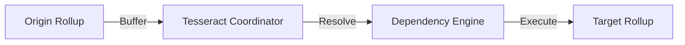

# Tesseract

**Cross-Rollup Atomic Transaction Execution System**

Tesseract enables coordinated transaction processing across multiple Layer 2 rollups with atomic execution guarantees. Built with Vyper smart contracts for maximum security.

---

## What is Tesseract?

Tesseract is a production-ready protocol for executing atomic transactions across multiple blockchain rollups. It solves the fundamental challenge of cross-chain coordination by providing:

- **Atomic Execution**: All-or-nothing transaction semantics across rollups
- **Dependency Resolution**: Intelligent handling of transaction dependencies
- **Time-Bounded Coordination**: Guaranteed execution within defined windows
- **Security-First Design**: Built with Vyper for memory safety and overflow protection



---

## Use Cases

### Cross-Chain DeFi

Execute atomic trades, rebalance liquidity pools, and coordinate lending operations across Ethereum, Polygon, Arbitrum, and Optimism.

### Enterprise Workflows

Enable complex business logic across blockchain networks for supply chain, identity management, and payment rails.

### Protocol Infrastructure

Build bridges, oracle networks, and interoperability layers with strong atomicity guarantees.

---

## Quick Start

Get started with Tesseract in minutes:

```bash
# Clone and install
git clone https://github.com/your-org/tesseract.git
cd tesseract
poetry install

# Verify installation
poetry run python scripts/test_compilation.py
```

[Get Started :material-arrow-right:](getting-started/quick-start.md){ .md-button .md-button--primary }

---

## Key Features

<div class="grid cards" markdown>

-   :material-shield-check:{ .lg .middle } **Security First**

    ---

    Vyper smart contracts with built-in overflow protection, role-based access control, and emergency circuit breakers.

-   :material-link-variant:{ .lg .middle } **Cross-Rollup Coordination**

    ---

    Atomic execution across Ethereum, Polygon, Arbitrum, and Optimism with dependency resolution.

-   :material-clock-fast:{ .lg .middle } **Time-Bounded Execution**

    ---

    Configurable coordination windows (5-300 seconds) ensure predictable transaction timing.

-   :material-gas-station:{ .lg .middle } **Gas Optimized**

    ---

    Efficient on-chain operations with ~80k gas per buffer and ~40k per resolution.

</div>

---

## Architecture Overview

Tesseract uses a **buffer-resolve-execute** pattern:

1. **Buffer**: Transactions are submitted with dependency information
2. **Resolve**: Dependencies are validated and timing constraints checked
3. **Execute**: Ready transactions are atomically executed across rollups

| Component | Description |
|-----------|-------------|
| `TesseractSimple.vy` | Main coordination contract (7,276 bytes) |
| Transaction Buffer | Secure storage for cross-rollup transactions |
| Dependency Engine | Validates and resolves transaction dependencies |
| Access Control | Role-based operator authorization |

---

## Supported Networks

| Network | Status | Testnet |
|---------|--------|---------|
| Ethereum | Ready | Sepolia |
| Polygon | Ready | Mumbai |
| Arbitrum | Ready | Goerli |
| Optimism | Ready | Goerli |

---

## Current Status

| Milestone | Status |
|-----------|--------|
| Contract Development | Complete |
| Local Testing | Complete |
| Testnet Deployment | Ready |
| Security Audit | Pending |
| Production Deployment | Pending |

---

## Next Steps

- [Quick Start Guide](getting-started/quick-start.md) - Deploy your first Tesseract instance
- [Core Concepts](concepts/overview.md) - Understand the architecture
- [API Reference](api/contract-api.md) - Complete contract documentation
- [Examples](examples/basic-usage.md) - Learn by example
