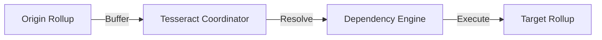

# Tesseract

**Cross-Rollup Atomic Swap Protocol**

Tesseract is a production-ready cross-rollup atomic swap protocol enabling trustless token exchanges across Ethereum L2s. Built with Vyper smart contracts, a high-performance Rust relayer, and comprehensive DeFi security features including MEV protection, flash loan resistance, and atomic swap groups.

---

## What is Tesseract?

Tesseract solves the fundamental challenge of cross-chain coordination by providing:

- **Atomic Execution**: All-or-nothing transaction semantics across rollups
- **MEV Protection**: Commit-reveal scheme prevents front-running and sandwich attacks
- **Flash Loan Resistance**: Minimum 2-block delay before transaction resolution
- **Time-Bounded Coordination**: Configurable execution windows (5-300 seconds)
- **Security-First Design**: Built with Vyper for built-in overflow protection


```mermaid
graph LR
    A[Origin Rollup] -->|Buffer| B[Tesseract Coordinator]
    B -->|Resolve| C[Dependency Engine]
    C -->|Execute| D[Target Rollup]
```

---

## Use Cases

### Cross-Chain DeFi

Execute atomic trades, rebalance liquidity pools, and coordinate lending across Ethereum, Polygon, Arbitrum, Optimism, and Base.

### Enterprise Workflows

Enable complex business logic across blockchain networks for supply chain, identity management, and payment rails.

### Protocol Infrastructure

Build bridges, oracle networks, and interoperability layers with strong atomicity guarantees.

---

## Quick Start

```bash
# Clone and setup environment
git clone https://github.com/cryptuon/tesseract.git
cd tesseract
uv sync

# Verify contract compilation (7 contracts)
uv run pytest tests/test_compilation.py -v

# Run full test suite
uv run pytest tests/ -v

# Deploy to testnet
uv run python scripts/deploy_simple.py sepolia
```

[Get Started :material-arrow-right:](getting-started/quick-start.md){ .md-button .md-button--primary }

---

## Key Features

<div class="grid cards" markdown>

-   :material-shield-check:{ .lg .middle } **DeFi Security**

    ---

    MEV protection via commit-reveal, flash loan resistance, reentrancy protection, and configurable slippage protection.

-   :material-link-variant:{ .lg .middle } **Cross-Rollup Coordination**

    ---

    Atomic swaps across Ethereum, Polygon, Arbitrum, Optimism, and Base with DAG-based dependency resolution.

-   :material-clock-fast:{ .lg .middle } **Time-Bounded Execution**

    ---

    Configurable coordination windows (5-300 seconds) ensure predictable transaction timing.

-   :material-coin:{ .lg .middle } **Tokenomics & Governance**

    ---

    TESS governance token, staking with tiered rewards (5-15% APY based on lock duration), and on-chain governance.

</div>

---

## Architecture Overview

Tesseract uses a **buffer-resolve-execute** pattern, backed by 7 Vyper contracts and a Rust relayer.

| Contract | Size | Purpose |
|----------|------|---------|
| `TesseractBuffer.vy` | 12,578 bytes | Core transaction buffering with DeFi security |
| `AtomicSwapCoordinator.vy` | 8,332 bytes | Order book and swap coordination |
| `TesseractToken.vy` | 4,521 bytes | TESS governance token (ERC-20) |
| `TesseractStaking.vy` | 6,890 bytes | Staking with tiered rewards |
| `FeeCollector.vy` | 3,245 bytes | Protocol fee collection and distribution |
| `RelayerRegistry.vy` | 4,112 bytes | Relayer bonding and management |
| `TesseractGovernor.vy` | 5,678 bytes | On-chain governance |

---

## Supported Networks

| Network | Mainnet | Testnet |
|---------|---------|---------|
| Ethereum | Ready | Sepolia |
| Polygon | Ready | Amoy |
| Arbitrum | Ready (One) | Sepolia |
| Optimism | Ready | Sepolia |
| Base | Ready | Sepolia |

---

## Current Status

| Component | Status |
|-----------|--------|
| Smart Contracts (7) | Complete |
| Rust Relayer | Complete |
| Test Suite (135 tests) | Complete |
| Monitoring Stack | Complete |
| Terraform Infrastructure | Complete |
| Testnet Deployment | Ready |
| Security Audit | Pending |

---

## Next Steps

- [Quick Start Guide](getting-started/quick-start.md) - Deploy your first Tesseract instance
- [Core Concepts](concepts/overview.md) - Understand the architecture
- [API Reference](api/contract-api.md) - Complete contract documentation
- [Examples](examples/basic-usage.md) - Learn by example
